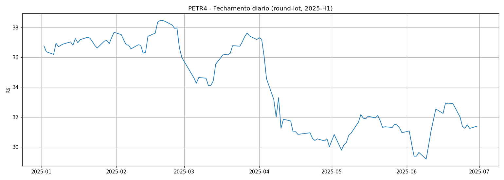
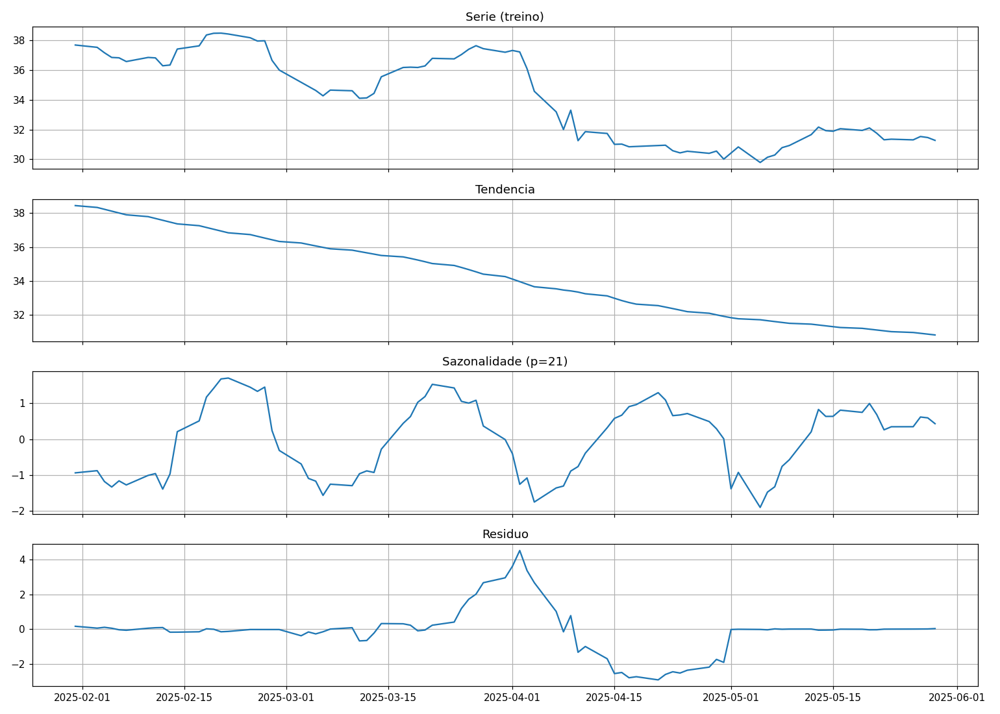
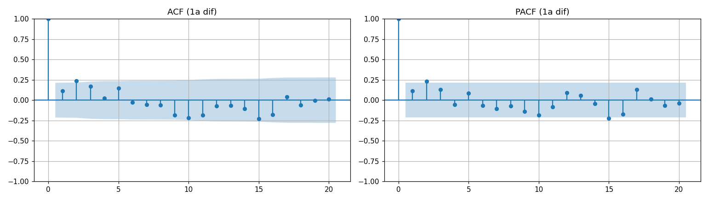
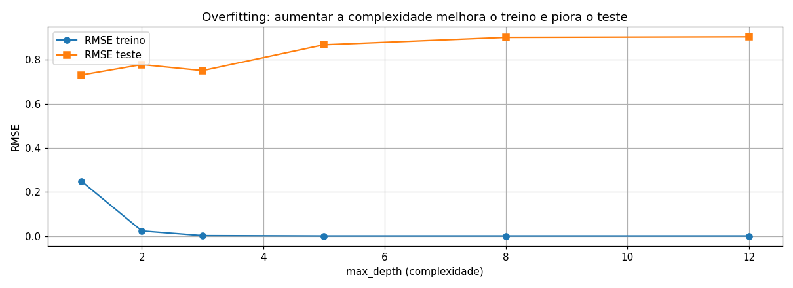
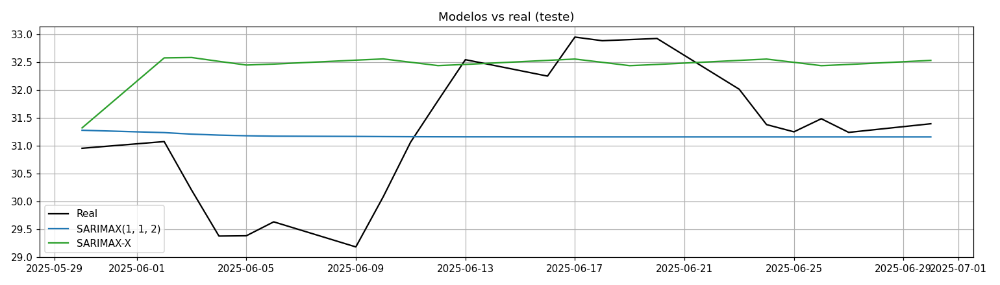
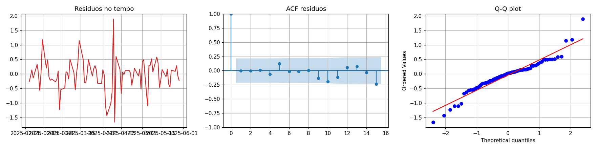
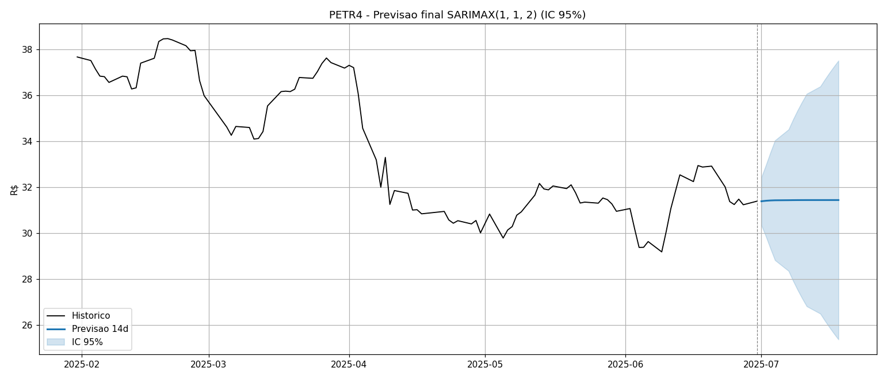
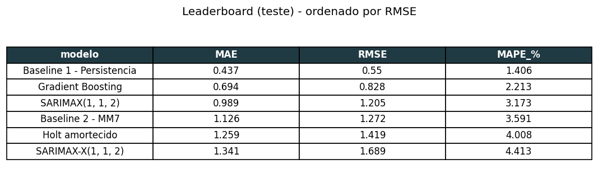

<p align="center">
    
</p>

<h1 align="center">PETR4 — Modelagem Preditiva e Análise Temporal</h1>

<p align="center"><strong>N3 — <i>Análise Preditiva</i>: Modelagem, Avaliação e Rastreio de Experimentos</strong></p>
<table align="center">
    <tr>
        <td><strong>Estudantes</strong></td>
        <td>Higor &middot; Nathan &middot; Nicolas Gustavo Conte</td>
    </tr>
    <tr>
        <td><strong>Curso</strong></td>
        <td>Engenharia de Software — 8º Semestre</td>
    </tr>
    <tr>
        <td><strong>Linha de Projeto</strong></td>
        <td>Ciência de Dados — Séries Temporais</td>
    </tr>
    <tr>
        <td><strong>Ativo / Fonte</strong></td>
        <td>PETR4 (Petrobras PN) — B3 <i>COTAHIST</i> 2025</td>
    </tr>
    <tr>
        <td><strong>Horizonte de Previsão</strong></td>
        <td>14 pregões</td>
    </tr>
    <tr>
        <td><strong>Rastreio de Experimentos</strong></td>
        <td>Weights &amp; Biases — projeto <code>b3-n3-series-temporais</code></td>
    </tr>
    <tr>
        <td><strong>Versão</strong></td>
        <td>1.0.0</td>
    </tr>
</table>

# 1. Visão Geral e Contexto (O Problema)

A previsão de curto prazo do preço de ativos é uma das tarefas mais sensíveis da análise quantitativa: o preço de uma ação reflete, a cada pregão, um equilíbrio ruidoso entre fluxo de ordens, fundamentos e expectativas. Para a **PETR4** (Petrobras PN), uma das ações mais líquidas da _B3_, esse desafio é amplificado pela exposição a fatores exógenos — preço do petróleo (_Brent_), câmbio (_USD/BRL_), política de dividendos e geopolítica.

Este projeto constrói um _pipeline_ completo de modelagem preditiva sobre a série de fechamento diário da PETR4 em 2025, cobrindo desde a auditoria de qualidade dos dados até a previsão final com intervalo de confiança, passando por _baselines_, testes de estacionariedade, três famílias de modelos e validação temporal _walk-forward_. Todo o ciclo é versionado no _Weights & Biases_ (_wandb_) para garantir reprodutibilidade e comparação justa entre os experimentos.

## 1.1. Contexto e Motivação

O preço diário de uma ação líquida tende a se comportar como um _random walk_<sup>[[1]](#ref-1)</sup>: o melhor palpite para o valor de amanhã é, com frequência, o valor de hoje. Qualquer modelo que se proponha a prever esse preço precisa, portanto, ser confrontado contra essa referência ingênua — caso contrário, métricas aparentemente boas podem mascarar um desempenho que não supera o trivial. Estabelecer essa **régua de desempenho** e medir rigorosamente cada modelo contra ela é o fio condutor de todo o trabalho.

## 1.2. Objetivos

### Objetivo Geral

Desenvolver, avaliar e comparar modelos de previsão para o fechamento diário da PETR4, determinando se é possível superar de forma consistente um _baseline_ de persistência e quantificando a incerteza das previsões.

### Objetivos Específicos

- Auditar e tratar a série, corrigindo problemas de qualidade que comprometeriam a modelagem;
- Construir atributos preditivos (_lags_, médias móveis e codificação cíclica de calendário);
- Implementar **três famílias de modelos** de naturezas distintas e conectá-las às _features_ derivadas;
- Selecionar hiperparâmetros por critério de informação (_AIC_) e demonstrar o efeito do _overfitting_;
- Validar a robustez temporal por _walk-forward_ e diagnosticar formalmente os resíduos;
- Rastrear todos os experimentos no _wandb_ e consolidar um _leaderboard_ orientado a decisão.

## 1.3. Conjunto de Dados

A fonte é o arquivo `cotahist_2025_tratado.csv`, derivado do histórico oficial de cotações da _B3_ (_COTAHIST_)<sup>[[2]](#ref-2)</sup>. Após o tratamento descrito na Seção 2, a série analisada possui **128 pregões**, cobrindo o período de **02/01/2025 a 30/06/2025**, com preços na faixa de **R\$ 29,18 a R\$ 38,48**.

# 2. Auditoria e Qualidade dos Dados

## 2.1. Diagnóstico de Qualidade

A auditoria estrutural verificou dimensão, período, frequência, nulos, duplicatas, _gaps_ de calendário e _outliers_. O resultado consolidado é apresentado abaixo.

| Métrica | Valor |
|---|---|
| Pregões (após tratamento) | 128 |
| Período | 02/01/2025 → 30/06/2025 |
| Faixa de preço | R\$ 29,18 – 38,48 |
| _Business days_ no intervalo | 128 |
| _Gaps_ de calendário (feriados B3) | 6 |
| Nulos após reindexação + interpolação | 0 |
| Conflação de segmentos sob o ticker `PETR4` | **detectada e corrigida** |

<p align="center"><em>Tabela 1. Diagnóstico de Qualidade de Dados.</em></p>

## 2.2. Conflação de Segmentos sob o Ticker PETR4

A auditoria revelou um problema crítico, não tratado na versão anterior do projeto: no arquivo bruto, o ticker `PETR4` **agrega múltiplos segmentos de mercado sob o mesmo identificador**, sem uma coluna que os distinga. Para uma mesma data, convivem fechamentos materialmente diferentes — por exemplo, um registro à vista de ~R\$ 37 e outro segmento de ~R\$ 43.

A consequência é severa: uma agregação ingênua por data com `groupby('data').last()` seleciona um segmento **arbitrário** a cada dia, injetando _spikes_ artificiais que contaminam toda a modelagem subsequente (médias móveis, estacionariedade, resíduos e previsões). O tratamento adotado isola o **lote-padrão (mercado à vista)** e agrega por dia, produzindo uma série coerente que reproduz fielmente a dinâmica real do ativo — inclusive o forte recuo de **abril de 2025**, associado ao choque tarifário global.


<p align="center"><em>Figura 1. Série de fechamento diário (lote-padrão) da PETR4 — 2025.</em></p>

## 2.3. Tratamento e Imputação

A série foi reindexada para o calendário de dias úteis e os _gaps_ de feriados foram preenchidos por **interpolação temporal**. Optou-se deliberadamente por **não** preencher com zero: em uma série de preços, o valor nulo distorceria médias móveis e retornos, gerando _spikes_ artificiais que prejudicariam o treino dos modelos.

# 3. Engenharia de Atributos

## 3.1. Lags, Médias Móveis e Codificação Cíclica

A partir do fechamento, foram derivados três grupos de atributos: _lags_ autorregressivos (`lag1`, `lag2`, `lag5`), médias móveis (`mm7`, `mm21`, calculadas com `shift(1)` para evitar vazamento) e a **codificação cíclica** de calendário (mês e dia-da-semana em pares seno/cosseno), que preserva a natureza contínua e periódica do tempo.

## 3.2. Hipóteses das Features

| _Feature_ | Hipótese |
|---|---|
| `lag1` | Memória curta: o preço de hoje depende fortemente do de ontem (persistência). |
| `lag2`, `lag5` | _Momentum_ de curtíssimo prazo e ciclo semanal. |
| `mm7` | Tendência de curto prazo (uma semana de pregões). |
| `mm21` | Tendência mensal; alisa flutuações semanais. |
| `mes_sin`, `mes_cos` | Sazonalidade anual em forma contínua. |
| `dow_sin`, `dow_cos` | Efeito dia-da-semana (ex.: _Monday effect_). |

<p align="center"><em>Tabela 2. Hipóteses das features de engenharia.</em></p>

## 3.3. Particionamento Temporal

Após `dropna()`, o conjunto final foi dividido cronologicamente, **sem embaralhamento**, em ~80% para treino (85 observações) e ~20% para teste (22 observações), preservando a ordem temporal exigida por séries.

# 4. Metodologia e Modelagem

## 4.1. Estacionariedade e Decomposição

A estacionariedade foi avaliada pelos testes _ADF_<sup>[[3]](#ref-3)</sup> e _KPSS_, complementados pela decomposição _STL_ e pelos gráficos de _ACF/PACF_.

| Evidência | Resultado | Interpretação |
|---|---|---|
| _ADF_ (série original) | p = 0,5841 | não-estacionária (_random walk_) |
| _KPSS_ (série original) | p = 0,01 | corrobora a não-estacionariedade |
| _ADF_ (1ª diferença) | p = 0,0001 | **estacionária** após `d = 1` |

<p align="center"><em>Tabela 3. Evidências de estacionariedade.</em></p>


<p align="center"><em>Figura 2. Decomposição STL: tendência, sazonalidade e resíduo (treino).</em></p>


<p align="center"><em>Figura 3. ACF e PACF da série diferenciada — sugerem p, q ∈ {0,1,2}.</em></p>

## 4.2. Baselines — A Régua de Desempenho

Foram construídas duas referências que qualquer modelo "de verdade" deve buscar superar: **Persistência** (_naïve_: a previsão de amanhã é o valor de hoje) e **Média Móvel de 7 dias**. Suas métricas formam a régua contra a qual todos os modelos são comparados na Seção 5.

## 4.3. Modelos (Três Famílias) e Conexão das Features

| Modelo | Família | Conexão com as _features_ |
|---|---|---|
| **SARIMAX(1,1,2)** | Clássico (Box-Jenkins<sup>[[4]](#ref-4)</sup>) | univariado; ordem por _AIC_ |
| **SARIMAX-X** | Clássico com exógenas | _features_ cíclicas (mês, dia-da-semana) como regressores |
| **Holt amortecido** | Suavização exponencial | univariado; tendência sem sazonalidade |
| **Gradient Boosting** | _Machine Learning_ | usa **toda** a matriz de _features_ (`lags`, `mm`, cíclicas) |
| _LSTM multivariado_ | _Deep Learning_ (opcional) | _features_ + janela deslizante (requer _TensorFlow_) |

<p align="center"><em>Tabela 4. Modelos implementados e como as features são conectadas.</em></p>

## 4.4. Seleção de Hiperparâmetros (AIC) e Overfitting

A ordem do modelo clássico foi escolhida por busca em grade minimizando o _AIC_: a especificação vencedora foi **SARIMAX(1,1,2)** (_AIC_ = 137,33), seguida de perto por (0,1,2) = 137,36 e (2,1,0) = 137,43.

O efeito do _overfitting_ foi demonstrado aumentando a complexidade de um modelo (profundidade do _Gradient Boosting_): o erro de **treino** despenca em direção a zero enquanto o erro de **teste** sobe — a clássica "tesoura". É exatamente esse trade-off que o _AIC_ e o _early stopping_ existem para penalizar.


<p align="center"><em>Figura 4. Overfitting: mais complexidade melhora o treino e piora o teste.</em></p>

## 4.5. Validação Temporal (Walk-Forward)

A robustez foi avaliada por _walk-forward_ (janela deslizante de 60 observações, re-treino a cada 7 dias), que reproduz o uso em produção. O _RMSE_ obtido (0,938) ficou próximo do ajuste único, indicando estabilidade da série no período — o _trade-off_ entre custo computacional e robustez é favorável dada a baixa quantidade de re-ajustes.

# 5. Resultados e Avaliação

## 5.1. Régua de Desempenho

| Modelo | MAE | RMSE | MAPE % |
|---|---|---|---|
| **Baseline 1 — Persistência** | **0,437** | **0,550** | **1,41** |
| Gradient Boosting | 0,694 | 0,828 | 2,21 |
| SARIMAX(1,1,2) | 0,989 | 1,205 | 3,17 |
| Baseline 2 — MM7 | 1,126 | 1,272 | 3,59 |
| Holt amortecido | 1,259 | 1,419 | 4,01 |
| SARIMAX-X(1,1,2) | 1,341 | 1,689 | 4,41 |

<p align="center"><em>Tabela 5. Métricas no conjunto de teste, ordenadas por RMSE.</em></p>

O resultado mais relevante é honesto e esperado: **nenhum modelo formal supera a Persistência** (RMSE 0,550), evidência empírica do comportamento de _random walk_ e da eficiência de curto prazo do ativo. Entre os modelos "de verdade", o **Gradient Boosting** lidera (RMSE 0,828), porém com importância de _features_ dominada por `lag1` (0,91) — ou seja, ele essencialmente re-aprende a persistência. Vale notar que as _features_ cíclicas **não** melhoraram o SARIMAX (SARIMAX-X ficou pior), confirmando a ausência de sazonalidade de calendário no preço diário.


<p align="center"><em>Figura 5. Previsões dos modelos versus série real (teste).</em></p>

## 5.2. Modelo Principal e Diagnóstico de Resíduos

Como **modelo principal** recomendado adota-se o **SARIMAX(1,1,2)** — não por menor erro pontual, mas pela combinação de interpretabilidade, intervalos de confiança nativos e diagnóstico formal. A análise dos resíduos _in-sample_ confirma a adequação: o teste de **Ljung-Box** retorna **p = 0,714** (> 0,05), indicando resíduos compatíveis com **ruído branco**; a _ACF_ não exibe _spikes_ significativos e o _Q-Q plot_ aproxima-se da normal.


<p align="center"><em>Figura 6. Diagnóstico de resíduos in-sample do SARIMAX(1,1,2).</em></p>

## 5.3. Previsão Final

O modelo principal foi re-treinado em toda a série para gerar a previsão de **14 pregões** à frente, com intervalo de confiança de 95%. A trajetória prevista é essencialmente plana (~R\$ 31,4), consistente com o _random walk_, e o intervalo de confiança alarga-se rapidamente — reforçando que previsões pontuais de preço além de ~2 semanas carregam incerteza elevada.


<p align="center"><em>Figura 7. Previsão de 14 pregões com IC 95%.</em></p>

## 5.4. Rastreio de Experimentos — Weights & Biases

Cada modelo (incluindo _baselines_) foi registrado como um _run_ no projeto `b3-n3-series-temporais`, com hiperparâmetros e métricas de teste. O _leaderboard_, ordenado por _RMSE_, consolida a decisão.


<p align="center"><em>Figura 8. Leaderboard (teste) — ordenado por RMSE.</em></p>

O rastreio roda em **modo online** por padrão, com **login seguro**: a chave de API nunca fica no código — ela vem do comando `wandb login` (armazenada no `~/.netrc`) ou da variável de ambiente `WANDB_API_KEY`. Se nenhuma credencial é detectada, o _pipeline_ cai automaticamente para **offline** e os _runs_ podem ser enviados depois.

```bash
# Opção 1 — autenticar e rodar online (os runs sobem em tempo real)
wandb login                       # cola a chave UMA vez → ~/.netrc, nunca no código
python pipeline.py

# Opção 2 — rodar offline e sincronizar depois
python pipeline.py
wandb sync wandb/offline-run-*
```

# 6. Conclusões e Recomendações

## 6.1. Principais Achados

- A PETR4 em 2025-H1 comporta-se como _random walk_: a **Persistência** (RMSE 0,550) não é superada por nenhum modelo formal, evidência de eficiência de curto prazo;
- O **Gradient Boosting** é o melhor modelo "de verdade" (RMSE 0,828), mas re-aprende a persistência via `lag1`;
- O **SARIMAX(1,1,2)** é o modelo principal recomendado pela interpretabilidade e pelo IC nativo, com resíduos validados como ruído branco (Ljung-Box p = 0,714).

## 6.2. Limitações

O modelo é **univariado** e ignora fatores exógenos relevantes (_Brent_, câmbio, fluxo estrangeiro). Eventos extraordinários (dividendos, crises) não são capturados, e as bandas de confiança alargam-se rapidamente além de duas semanas.

## 6.3. Trabalhos Futuros

Incorporar variáveis exógenas macroeconômicas em modelos _ARIMAX_/_ML_ multivariados; avaliar _LSTM_ e _Prophet_ sobre as _features_ já preparadas; e sincronizar os _runs_ do _wandb_ para um _leaderboard_ online colaborativo.

# 7. Reprodução

## 7.1. Stack Tecnológica

`Python` · `pandas` · `numpy` · `statsmodels` · `scikit-learn` · `matplotlib` · `scipy` · `wandb`

## 7.2. Execução

```bash
pip install pandas numpy statsmodels scikit-learn matplotlib scipy wandb
python pipeline.py
```

O _script_ gera as figuras (`figs/`), `results.json`, `tabela_metricas.csv` e os _runs_ offline do _wandb_.

## 7.3. Estrutura do Repositório

| Arquivo | Conteúdo |
|---|---|
| `N3_SeriesTemporais_PETR4_EXECUTADO.ipynb` | _notebook_ **executado** (saídas e figuras embutidas) |
| `pipeline.py` | _pipeline_ reprodutível de ponta a ponta |
| `petr4_daily_clean.csv` | série diária limpa (lote-padrão) |
| `results.json` · `tabela_metricas.csv` | métricas e resultados consolidados |
| `figs/` | figuras (série, decomposição, ACF/PACF, modelos, resíduos, _overfitting_, previsão, _leaderboard_) |

# 8. Referências

<a name="ref-1"></a>[1] FAMA, E. F. _Efficient Capital Markets: A Review of Theory and Empirical Work_. The Journal of Finance, v. 25, n. 2, 1970.

<a name="ref-2"></a>[2] B3 S.A. — BRASIL, BOLSA, BALCÃO. _Layout do arquivo histórico de cotações (COTAHIST)_. Disponível em: https://www.b3.com.br. Acesso em: jun. 2026.

<a name="ref-3"></a>[3] DICKEY, D. A.; FULLER, W. A. _Distribution of the Estimators for Autoregressive Time Series with a Unit Root_. Journal of the American Statistical Association, v. 74, 1979.

<a name="ref-4"></a>[4] BOX, G. E. P.; JENKINS, G. M. _Time Series Analysis: Forecasting and Control_. Holden-Day, 1970.

<a name="ref-5"></a>[5] HYNDMAN, R. J.; ATHANASOPOULOS, G. _Forecasting: Principles and Practice_. 3. ed. OTexts, 2021. Disponível em: https://otexts.com/fpp3/.
